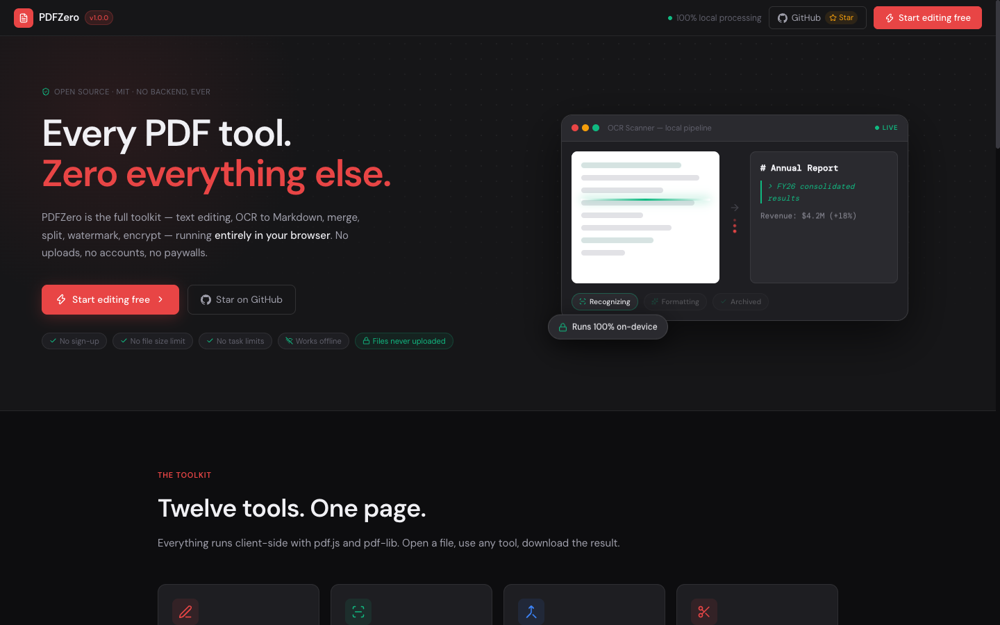
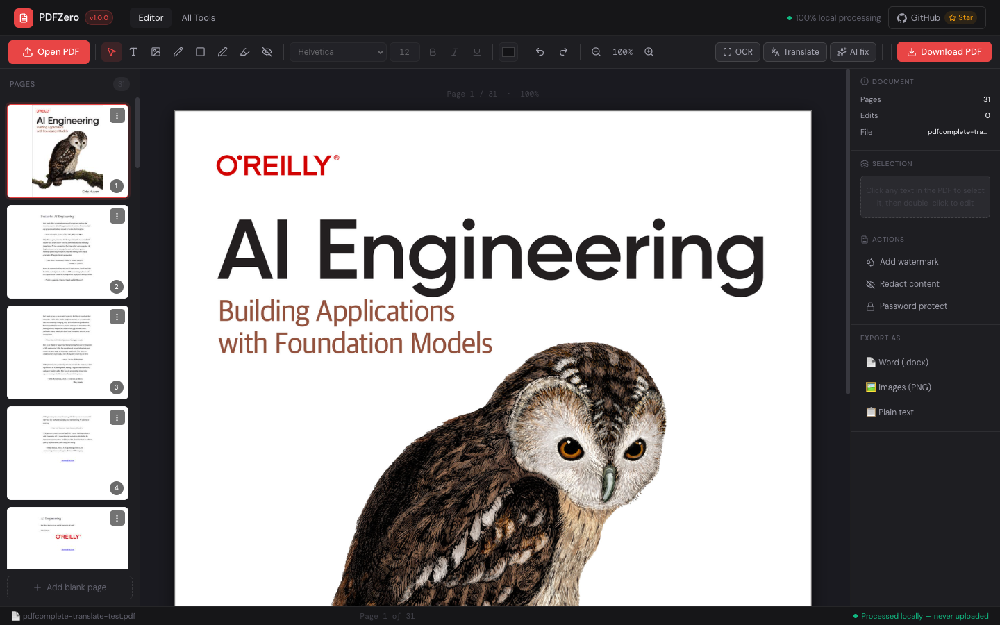
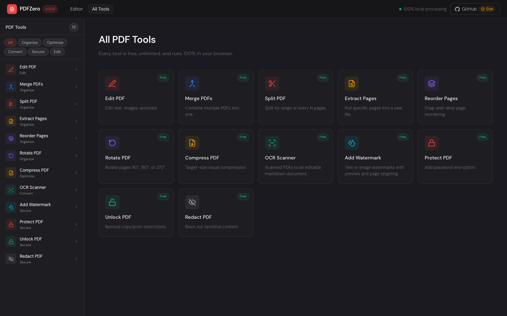

# 📄 PDFZero — Free Open-Source PDF Editor

> [!NOTE]
> **This is a community fork.** PDFZero was originally created by **[@bevinkatti](https://github.com/bevinkatti)**
> ([bevinkatti/PdfZero](https://github.com/bevinkatti/PdfZero), MIT License). All credit for the original idea,
> implementation, and design belongs to him. Since upstream is no longer actively maintained, this fork carries
> the project forward — please open issues and PRs **here**.

> Edit PDFs without uploading anywhere. No task limits. No sign-up. Free.

[](<>)
[](LICENSE)
[](<>)
[](<>)
[](<>)
[](<>)
[](<>)
[](<>)
[](<>)

---

## Why PDFZero?

Many PDF tools charge monthly, cap file sizes, or limit what you can do on free plans. PDFZero keeps the core workflow simple: edit locally, keep your files on-device, and use every tool without a paywall.

| Feature                | Other PDF tools                       | **PDFZero**            |
| ---------------------- | ------------------------------------- | ---------------------- |
| Edit existing PDF text | Often paid or limited                 | **Free**               |
| File size limits       | Often capped                          | **No file size limit** |
| Daily task limits      | Free plans may stop after a few tasks | **No task limits**     |
| File privacy           | Files may be uploaded to a server     | **100% local**         |
| Offline use            | Usually browser or cloud-based        | **Works offline**      |
| Open source            | Rare                                  | **MIT**                |
| OCR for scanned PDFs   | Often paid                            | **Free (local)**       |
| Translate PDFs         | Often paid                            | **Free (AI, opt-in)**  |
| Cost                   | Many plans charge monthly             | **Free**               |

---

## Screenshots

| Editor                                                                                                      | Tools                                                          |
| ----------------------------------------------------------------------------------------------------------- | -------------------------------------------------------------- |
|                                                                             |                                 |

---

## Features

### Edit

- **Edit existing PDF text** — click any text block, edit in-place, auto-detected original font
- Add new text boxes anywhere on the page
- Change font family, size, color, bold, and italic
- Annotations (highlight, redact, shapes)
- **AI page translation (English ↔ Spanish)** — one click from the editor toolbar translates the page in context, re-fitted to the original text-box geometry. Powered by GLM-5.3-Flash via the Z.AI API — opt-in, your own key.

### Organize

- Merge multiple PDFs with drag-to-reorder
- Split PDF by page range, every N pages, or one file per page
- Reorder pages via drag-and-drop
- Rotate all or individual pages
- Extract specific pages (`1, 3, 5-8`)

### Optimize

- Lossless compression
- Target-size compression with iterative quality reduction

### Secure

- Password protect with AES-256 (open + owner passwords)
- **Unlock: real decryption** — removes the Standard security handler entirely (AES-256/AESV3, AES-128, RC4 40/128), restrictions gone for good
- Redact sensitive content permanently
- Text or image watermarks with live preview, tiling, and page targeting

### Smart

- **OCR Scanner workspace** — scanned PDFs become editable markdown documents (tables, lists, code blocks preserved) in a rich editor, with automatic Spanish titles, a persistent IndexedDB archive, ~1s autosave, and .md/.txt export
- OCR recognition runs 100% locally on your machine via a local Ollama `glm-ocr` model (page-level OCR also available inside the editor)
- Per-block background color sampling so edits and whiteouts blend into watermarked or colored pages

---

## Tech Stack

| Library                                      | Purpose                                                     |
| -------------------------------------------- | ----------------------------------------------------------- |
| [pdf-lib](https://pdf-lib.js.org/)           | PDF creation, modification, export, encryption              |
| [PDF.js](https://mozilla.github.io/pdf.js/)  | PDF rendering and text extraction                           |
| [Ollama](https://ollama.com/) + `glm-ocr`    | OCR recognition, 100% local                                 |
| [GLM-5.3-Flash (Z.AI)](https://docs.z.ai/)   | OCR formatting, Spanish titles, EN↔ES translation (opt-in)  |
| [@mdxeditor/editor](https://mdxeditor.dev/)  | Markdown editing in the OCR Scanner                         |
| [React](https://react.dev/)                  | UI framework                                                |
| [Zustand](https://zustand-demo.pmnd.rs/)     | State management                                            |
| [Vite](https://vitejs.dev/)                  | Build tool                                                  |

**All PDF processing is 100% browser-native — your files never leave your device.** OCR recognition runs on your own machine via a local Ollama server. The only network features are the opt-in GLM ones (OCR formatting/titles in the Scanner, page translation), which send text snippets to the Z.AI API using your own key. Everything else works offline.

---

## Getting Started

```bash
git clone https://github.com/zademy/PdfZero.git
cd PdfZero
npm install

# Optional — enable the GLM features (OCR formatting, Spanish titles, EN↔ES translation)
cp .env.example .env.local
# then set VITE_GLM_API_KEY in .env.local (https://z.ai/manage-apikey/apikey-list)

# Optional — enable OCR recognition (local Ollama + glm-ocr model)
# install Ollama from https://ollama.com, then:
ollama pull glm-ocr

npm run dev      # Vite dev server
npm run build    # production build
npm test         # Vitest unit tests (src/lib/*.test.js)
npm run lint     # ESLint
```

> The dev server serves COOP/COEP headers configured in `vite.config.js` — kept deliberately; don't remove them.
>
> Without `VITE_GLM_API_KEY`, the OCR Scanner disables Run OCR with a configuration alert; without Ollama, OCR surfaces one actionable setup toast. Everything else in the app works without either.

---

## Architecture

```text
PDF bytes
  -> PDF.js render + text extraction
  -> canonical text run metadata
  -> browser overlay editor
  -> layout-fit/export planner
  -> pdf-lib browser export
```

1. **Render** — PDF.js renders each page to a high-resolution canvas.
2. **Extract** — PDF.js extracts text runs, transforms, font ids, colors, baselines, and edit boxes.
3. **Model** — the store keeps original run metadata (text, bbox, baseline, font fallback, color, glyph advances).
4. **Overlay** — editable DOM text sits over the PDF raster with local background sampling to hide the original text while editing.
5. **Fit** — on export, edited text is laid out line-by-line and fit back to the original run width.
6. **Export** — pdf-lib writes background patches, replacement text, annotations, and page operations.

This is an overlay-and-repair browser exporter, not yet full Acrobat-style object editing; embedded subset fonts and kerning-preserving replacement remain future work. See [AGENTS.md](AGENTS.md) for the full directory map and per-module validation workflows.

---

## What's new in this fork

Highlights on top of the original [bevinkatti/PdfZero](https://github.com/bevinkatti/PdfZero):

- **Real PDF decryption (Unlock)** — removes AES-256/AES-128/RC4 encryption entirely instead of re-saving ciphertext; optional open-password input. Found and fixed via a full 12-tool E2E battery with byte-level output verification.
- **Landing page redesign** — the fork's own product identity: animated OCR pipeline hero, honest 4-way comparison (vs Stirling PDF / Smallpdf / iLovePDF), English-only content, fork-attributed footer.
- **Deep-linkable tools** — `/tools/merge`, `/tools/split`, … activate their tool directly; URL stays in sync while browsing.
- **OCR Scanner workspace** — scanned PDFs become editable markdown documents with GLM formatting (3× retries), automatic Spanish titles, persistent IndexedDB archive, autosave, and .md/.txt export.
- **Local-first OCR engine** — Tesseract.js replaced by a local Ollama `glm-ocr` model (ADR 0002), with deterministic block cleanup upstream of formatting (ADR 0001).
- **AI page translation (EN↔ES)** — page-level contextual translation with width-fitted re-layout so translated text stays inside the original boxes.
- **v1.0.0 release automation** — version badge from `package.json`, CI (lint + tests + build) on PRs, auto tag + GitHub Release (full commit list + dist zip) on every green push with a version bump.

See [CHANGELOG.md](CHANGELOG.md) for the complete history.

---

## Contributing

PRs are very welcome — against **this fork**. Please read [CONTRIBUTING.md](CONTRIBUTING.md) first, open an issue for major changes, and follow our [Code of Conduct](CODE_OF_CONDUCT.md). See also [SECURITY.md](SECURITY.md) and [SUPPORT.md](SUPPORT.md).

```bash
npm install
npm run dev
npm test
```

---

## Acknowledgments

- **[bevinkatti](https://github.com/bevinkatti)** — original author of PDFZero. This fork exists because of his work.
- The [PDF.js](https://mozilla.github.io/pdf.js/), [pdf-lib](https://pdf-lib.js.org/), and [Ollama](https://ollama.com/) teams.

---

## License

MIT — original project © **bevinkatti**; changes in this fork © [PdfZero contributors](https://github.com/zademy/PdfZero/graphs/contributors).
See [LICENSE](LICENSE).

---

If you find PDFZero useful, consider giving a ⭐ to both [the original](https://github.com/bevinkatti/PdfZero) and this fork.
